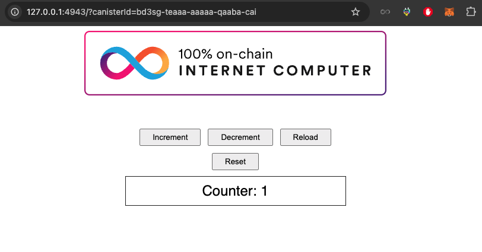
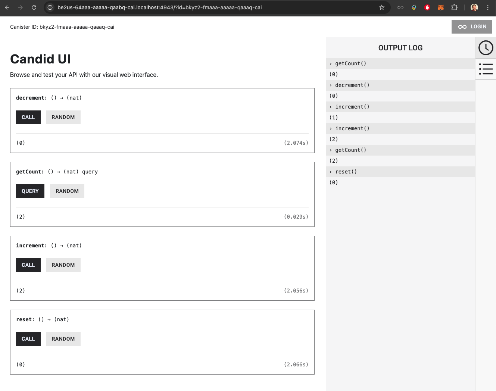

# Minimal counter dapp



The example dapp shows how to build a very basic dapp with both backend and frontend, using Motoko for the backend functionality and plain HTML and JavaScript for the frontend. The dapp is a simple counter, which will increment, decrement or reset a counter by clicking a button in the frontend.

The purpose of this example dapp is to build a minimalistic dapp, based on the default dapp template, installed by `dfx` when creating a new project.

This example covers:

- Create a new canister smart contract using the IC SDK (`dfx`).
- Use the default project as a template as the starting point for the new project.
- Add backend functions for a counter (increment, getCount, decrement and reset).
- Implement backend functions in the frontend.
- Deploy the canister smart contract locally.
- Test backend with Candid UI and command line using `dfx`, and test frontend in browser.

### Prerequisites
This example requires an installation of:

- [x] Install the [IC SDK](https://internetcomputer.org/docs/current/developer-docs/setup/install/index.mdx).
- [x] Clone the example dapp project: `git clone https://github.com/dfinity/examples`

Begin by opening a terminal window.

## Step 1: Setup the project environment

Navigate into the folder containing the project's files and start a local instance of the Internet Computer with the commands:

```bash
cd examples/motoko/minimal-counter-dapp
dfx start --background
```

## Step 2: Build and deploy the canister

```bash
dfx deploy
```

The output will resemble the following:

```bash
Deployed canisters.
URLs:
  Frontend canister via browser
    minimal_dapp_frontend:
      - http://127.0.0.1:4943/?canisterId=bd3sg-teaaa-aaaaa-qaaba-cai
      - http://bd3sg-teaaa-aaaaa-qaaba-cai.localhost:4943/
  Backend canister via Candid interface:
    minimal_dapp_backend: http://127.0.0.1:4943/?canisterId=be2us-64aaa-aaaaa-qaabq-cai&id=bkyz2-fmaaa-aaaaa-qaaaq-cai
```

## Step 3: Open the `minimal_dapp_frontend` URL in a web browser

You will see a GUI interface with following buttons:

- **Increment** - On click, the counter value will increase by 1.
- **Decrement** - On click, the counter value will decrease by 1.
- **Reload** - On click, the counter value will be reloaded. This is useful in case the value has been changed via Candid interface.
- **Reset** - On click, the counter value will be reset to 0.

## Architecture
The three main parts of the example dapp are the backend, the Candid interface, and the frontend. This example project is based on the default project, which is created when running the `dfx new project_name` command, but most of the default project code is replaced to create the counter functionality in this project.

### Motoko backend
The backend functions are located in the `src/minimal_dapp_backend/main.mo` Motoko file. The backend stores the counter value and has functions to get, increment, decrement and reset the counter value.

#### Counter variable
Four functions are created to make the counter work: `increment()`, `decrement()`, `getCount()` and `reset()`. The current counter value is stored as a number in the actor.


```javascript
actor {
    var counter : Nat = 0;
}
```

#### increment()
The `increment()` function increments the counter variable. This function is invoked when the user clicks the `Increment` button on the frontend, or when the function is called through the Candid interface.

```javascript
public func increment() : async Nat {
    counter += 1;
    return counter;
};
```

The function returns the incremented counter variable.

#### decrement()
The `decrement()` function decrements the counter variable. This function is invoked when the user clicks the `Decrement` button on the frontend, or when the function is called through the Candid UI.

```javascript
public func decrement() : async Nat {
    // avoid trap due to Natural subtraction underflow
    if(counter != 0) {
        counter -= 1;
    };
    return counter;
};
```

The function returns the decremented counter variable.

#### getCount()
The `getCount()` function returns the current counter value.

```javascript
public query func getCount() : async Nat {
    return counter;
};
```

#### reset()
The `reset()` function resets the counter value to 0 and returns the value.

```javascript
public func reset() : async Nat {
    counter := 0;
    return counter;
};
```

### Candid interface
The Candid interface is automatically created, and it has a convenient UI, which provides an easy, user-friendly way to test the backend. Learn how to access the Candid UI in the **Testing** section below. 

### Frontend
The default project installed with `dfx new project_name` implements the logic that serves the frontend in the `src/minimal_dapp_frontend/src/App.js` file, and most of the HTML is carried over from the default project.

The required JavaScript code to interact with the backend canister is automatically generated by `dfx` and can be found in the `src/declarations/minimal_dapp_backend` folder. The code creates an actor that enables the frontend to call the public functions of the backend canister.

```js
import { html, render } from 'lit-html';
import { minimal_dapp_backend } from 'declarations/minimal_dapp_backend';
import logo from './logo2.svg';

class App {
  counter = '';

  constructor() {
    this.#init();
  }

  #init = async () => {
    this.counter = await minimal_dapp_backend.getCount();
    this.#render();
  }

  #increment = async (e) => {
    e.preventDefault();
    this.counter = await minimal_dapp_backend.increment();
    this.#render();
  };

  #decrement = async (e) => {
    e.preventDefault();
    this.counter = await minimal_dapp_backend.decrement();
    this.#render();
  };

  #reload = async (e) => {
    e.preventDefault();
    this.#init();
  }

  #reset = async (e) => {
    e.preventDefault();
    this.counter = await minimal_dapp_backend.reset();
    this.#render();
  }

  #render() {
    let body = html`
      <main>
        
        <br />
        <br />
        <form action="#">
          <button id="increment-btn">Increment</button>
          <button id="decrement-btn">Decrement</button>
          <button id="reload-btn">Reload</button>
          <button id="reset-btn">Reset</button>
        </form>
        <section id="counter">Counter: ${this.counter}</section>
      </main>
    `;
    render(body, document.getElementById('root'));
    document.getElementById('increment-btn').addEventListener('click', this.#increment);
    document.getElementById('decrement-btn').addEventListener('click', this.#decrement);
    document.getElementById('reload-btn').addEventListener('click', this.#reload);
    document.getElementById('reset-btn').addEventListener('click', this.#reset);
    if (!this.counter) {
      document.getElementById('decrement-btn').disabled = true;
    } else {
      document.getElementById('decrement-btn').disabled = false;
    }
  }
}

export default App;
```

#### `dfx`
`dfx` has a subset of commands for canister operations, and one of them enables calling the public functions added to the `main.mo` file in the previous step. In the following examples the initial value is 0. `increment` will increment value, `getCount` will return the current value, `decrement` will decrement the value and `reset` will set the value to 0.

Command usage: `dfx canister call <project> <function>`

```bash
$ dfx canister call minimal_dapp_backend increment
(1 : Nat)
```

```bash
$ dfx canister call minimal_dapp_backend increment
(2 : Nat)
```

```bash
$ dfx canister call minimal_dapp_backend getCount
(2 : Nat)
```

```bash
$ dfx canister call minimal_dapp_backend decrement
(1 : Nat)
```

```bash
$ dfx canister call minimal_dapp_backend reset
(0 : Nat)
```

#### Candid UI
The Candid interface is automatically created, and it has a convenient UI, which provides an easy, user-friendly way to test the backend. The UI is also automatically generated, and the canister ID can be retrieved from the `dfx canister id <canister_name>` command.

```bash
$ dfx canister id __Candid_UI
be2us-64aaa-aaaaa-qaabq-cai
$ dfx canister id minimal_dapp_backend
bkyz2-fmaaa-aaaaa-qaaaq-cai
```

**http://\{candid_canister_id\}.localhost:4943/?id=\<backend_canister_id\>**



## License
This project is licensed under the Apache 2.0 license, see LICENSE.md for details. See CONTRIBUTE.md for details about how to contribute to this project.

## Security considerations and best practices

If you base your application on this example, we recommend you familiarize yourself with and adhere to the [security best practices](https://internetcomputer.org/docs/current/developer-docs/security/security-best-practices/overview) for developing on the Internet Computer. This example may not implement all the best practices.
